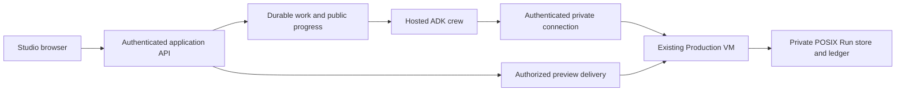

# The shortest route to a visible result

Updated 2026-09-08: [the first real hosted video is delivered](proofs/milestone-2-delivery-2026-09-08.md), with working Parallel credentials, live research/authors, an accepted Gemini illustration and one ElevenLabs Take. The local player is http://127.0.0.1:8765/. The user accepted the technical result and requested validation, commit and push of the programmatic work. Artistic/editorial acceptance remains open for later feedback. The accepted milestone order is recorded in [the priority decision](issues/02-name-the-demo-and-release-envelope.md).

## The product to finish

Studio update, September 8: the [private hosted workspace](https://vox-studio-164544259455.europe-west1.run.app)
is implemented and deployed. Authenticated submission, persistent progress, image decisions,
verified media delivery and browser refresh are exercised; the separately running worker has
started the newly authorized lightning/thunder trial and awaits a human image decision.
The fresh complete film and rehearsal gates remain open. See [current Studio evidence](proofs/studio-progress-2026-09-08.md).

A user opens a deployed Studio, submits a factual Brief, sees the crew research and construct a visual story, reviews an image when needed, and watches/downloads a real narrated preview. Closing the tab does not lose the work. Sources and actual phase status make the result trustworthy.

For the September 8 internal demo target, recommend controlled authenticated access, one active production attempt at a time, a short 30–60 second hero explainer using existing SceneCapabilities, and one deliberate image approval. Audience, Brief, staffing and spending choices remain in [Who uses the first Studio, with which Brief and limits?](issues/07-confirm-the-demo-envelope.md). The event and deadline are established; do not ask for them again.

The first user-visible deliverable is a real narrated video using the current ElevenLabs path. The initial video does not wait for a voice migration, a complete Studio or visual polish. Connect the smallest browser workspace next, then prove recovery. The final voice milestone follows the demonstrated product; it remains an outstanding submission-compliance concern, as recorded in the priority decision.

The distinctive story is already in the architecture: sourced research, specialist creative roles, human control over generated visuals, and animation synchronized to the narrator's actual words through deterministic compilation. Demonstrate that combination visibly. An agent activity panel alone does not establish output quality or eligibility, and no design can guarantee an award.

## What is actually present

| Part | Evidence in this checkout | Remaining delivery gap |
| --- | --- | --- |
| Production | Running pinned image, persistent Run store, deployed smoke checks and signed cloud-to-cloud proof | Hosted video delivered; historical receipt compatibility tracked separately |
| ADK crew | Deployed operator entry point, async Director, research/creative roles, checkpoint adapters, persistent disk and supervised bridge | Hosted run rendered; consolidate documented runtime overrides into the next deployment |
| Browser Studio | Private HTTPS workspace, persistent API, separate worker, real sources/status, image approval and verified media delivery | Authorized fresh trial awaits human image review; complete browser-to-film proof remains open |
| Recovery | Durable submission deduplication, exclusive execution locks and guarded checkpoint reconciliation; API restart preserves active worker/session | Live worker recovery and uncertain-render rehearsal still need proof; do not interrupt the active trial to simulate them |
| Research integration | Gemini grounding with Parallel Search implemented and deployed; citation binding tests pass; Parallel secret version 2 accepted | Grounded dossier proved; human editorial acceptance pending |
| Google model access | Google Cloud inference from crew identity proved; cloud image adapter deployed | Live authors and accepted image proved; deploy the migrated Gemini adapter for future Runs |
| Narration | Working ElevenLabs adapter and timestamp-based alignment | Keep for initial milestones; final provider work must preserve actual-word synchronization |
| Demo evidence | Prior remote Production preview and test evidence | Current factual Brief → live research → live authoring → accepted image → narrated preview, watched by a human |

Sources: [crew assembly](../../services/agents/src/vox_crew/crew_run.py), [ADK Director](../../services/agents/src/vox_crew/adk_roles.py), [checkpoint stores](../../services/agents/src/vox_crew/crew_state.py), [internal Component Studio](../../apps/component-studio/src/App.tsx), [remote proof](../cloud-phase/issues/09-a-brief-goes-in-at-a-url-and-a-preview-comes-out.md), [deployment record](../../deploy/README.md).

Session 11 verified Production and crew running in `studio-prod-7f3a/europe-west1-c`, with signed
contracts/status before and after crew restart. [The proof](proofs/cloud-path-progress-2026-09-07.md)
records deployed digests and limitations. This establishes the first milestone, not a complete
browser-to-video product. The older cloud hosting ticket's claim that ADK cannot host this crew
predates the custom Director and async seams; use the completed deployment research instead.

## The boundary to establish first

This shows responsibilities, not a requirement for seven separately deployed services. Keep the number of moving parts small. The browser owns no model, research, synthesis, image-provider or Production signing credential. The application constructs operator policy; an incoming Brief must not carry arbitrary spending grants or credentials. The agent receives public contracts and artifacts, never the Production implementation or disk.

The researched hosting recommendation belongs to [Which supported ADK deployment path fits this crew by tomorrow?](issues/01-choose-the-supported-adk-deployment-path.md), with the complete [deployment evidence](research/adk-deployment.md). A deployment CLI packages and launches an agent; the product still needs the application boundary shown above. The separate crew VM is deployed and proved in ticket 03; later Studio access choices and browser runtime proof remain open.

Google's supported Python shortcut for Cloud Run is `adk deploy cloud_run`; managed Agent Runtime is available through `adk deploy agent_engine`. The newer `agents-cli` also provides deployment scaffolding and `agents-cli deploy`; Agent Starter Pack now points new work there. [ADK Cloud Run documentation](https://adk.dev/deploy/cloud-run/), [Agents CLI deployment guide](https://adk.dev/deploy/agent-runtime/agents-cli/), [Agent Starter Pack status](https://github.com/GoogleCloudPlatform/agent-starter-pack). These are verified tool choices, not commands ready to deploy the current checkout unchanged.

Two traps are already evidenced locally:

- Production binds only `127.0.0.1` on its private VM. A hosted crew with VPC access still needs a concrete authorized route to that listener. If introducing a gateway or changing ingress, record the ADR-0018 topology amendment and test the isolation properties. Do not weaken the Run store to fit a serverless mount.
- Long synchronous renders previously lost the tunnel after 137–181 seconds while the server continued. Durable submission, operation status and reconciliation must outlive the browser request. Merely configuring a longer client timeout or saving an ADK session does not establish this. After an uncertain completion, inspect the same Production Run before authorizing more work.

Browser media now uses authenticated application routes and a digest-verified cache on the
Studio persistent disk. Historical MP4 playback, seeking and byte ranges are verified over HTTPS;
the fresh trial has not yet produced final media. Production retains its private POSIX Run store.

## Delivery milestones

Implementation update 2026-09-07 session 11: the separate crew VM and 10 GB data disk are
deployed. Signed contracts/status succeed before and after crew restart, with the same marker
and response hashes; SSH/IAM isolation checks pass. The first milestone is complete. See
[current evidence](proofs/cloud-path-progress-2026-09-07.md) and
[ticket 03](issues/03-connect-the-hosted-crew-without-breaking-production-isolation.md).
Both historical Runs refuse current receipt-schema validation; [ticket 08](issues/08-diagnose-historical-run-receipt-compatibility.md)
tracks compatibility independently of the new zero-quota connectivity Run.

These are observable implementation outcomes, not additional decision tickets. Only the first is complete. Attach evidence before marking a milestone complete; an earlier test report or a screen showing fixture data cannot satisfy a live-run milestone. Use a single-implementer baseline until staffing is known; no parallel engineering capacity is assumed.

| Done | Milestone | Work | Exit evidence |
| --- | --- | --- | --- |
| [x] | Cloud path answers | Production and crew deployed; private signed connection, persistent disk and separate operator policy verified | [Signed round trip before/after restart, deployed digests and isolation refusals](proofs/cloud-path-progress-2026-09-07.md) |
| [ ] | First real video to watch: technical result accepted, editorial review open | [Hosted Run rendered and MP4 delivered](proofs/milestone-2-delivery-2026-09-08.md), with research, live authors, accepted illustration and narration | User accepted the technical result; artistic/editorial feedback and acceptance remain |
| [ ] | Studio produces that result | Private hosted workspace and durable worker are deployed; the authorized fresh trial awaits human image approval | Refresh is verified; complete hosted film and human viewing remain pending in [current evidence](proofs/studio-progress-2026-09-08.md) |
| [ ] | Product holds up in rehearsal | Verify duplicate admission, restart and uncertain-render reconciliation; enforce spending/concurrency limits; improve visible states and composition | Second complete run, focused recovery checks, no duplicated paid dispatch, usable failure states and saved backup demonstration |
| [ ] | Final voice work | Address the deferred ElevenLabs compliance gap after the visible product; prove replacement audio and actual-word timing before integrating any provider change | Fresh end-to-end run with verified synchronization and provider evidence, or an explicitly unresolved submission blocker; the earlier ElevenLabs video alone cannot close this milestone |
| [ ] | Submission ready | Freeze the final revision; recheck access and requirements; capture the final English demo and publish the required source/license/instructions | Tested hosted URL, public repository, final video and completed submission before cutoff |

The cloud round trip and real hosted video production are proved. The final MP4 is delivered
on the user's PC and technically accepted; capture artistic/editorial feedback next. Continue toward the smallest Studio workspace
without regenerating the delivered video or repeating the hosting comparison.

Prepare the Studio shell when useful, but do not postpone the first MP4 until the whole application is ready. One workspace, polling, native playback and a single image-approval action are the baseline recommendation. SceneInstance editing is outside this delivery sequence.

Target the visible video and Studio on September 8. Reserve a separate final engineering window for voice work, followed by a rerun and final capture. Protect the last four hours before the September 9, 22:00 Tunis cutoff for verification and submission. Voice work is last among engineering milestones, not something to start during the submission buffer. If it cannot be completed, keep its status unresolved rather than call the ElevenLabs release compliant.

## The Studio scope that earns its time

Keep one focused workspace: Brief entry and an example to start; a prominent player; compact actual phase progress; Sources and Storyboard views; an image review card only when a decision is required. Persisted state drives the screen after refresh. Public crew events already exist; subscribe to the async crew boundary rather than the CLI, which currently collects updates before printing.

The audience should understand what is happening without reading logs. Surface useful milestones and reviewed artifacts, not chain-of-thought, arbitrary percentages or raw JSON. Show a factual Decline as an intelligible editorial limitation rather than a crashed spinner. Recorded material must be explicitly labelled.

Recommend a new product app alongside the internal gallery, reusing the repository's existing React/Vite familiarity and visual language if the selected host supports it. A framework migration is not on the critical path. Prefer playing the produced video for this release; a full in-browser Remotion editing pipeline increases scope and may expose implementation unnecessarily.

One human image-approval moment is the best first interaction because it already exists in the domain workflow. Prompt editing would require migration, validation and preview invalidation; the frozen architecture's section on prompt editing explicitly calls out that real cost. Defer it unless the completed live path leaves time and the user explicitly chooses it.

## Suggested release gates

The final agreed gates belong in [What evidence makes this release ready to demonstrate and submit?](issues/06-set-the-release-and-rehearsal-gates.md). Product proof and submission readiness are separate: ElevenLabs can satisfy the initial visible-video milestone under the user's decision, while the final voice milestone stays open. Recommended product minimum:

- A fresh browser reaches the deployed Studio and produces a playable/downloadable narrated preview entirely through cloud-hosted execution.
- At least one factual run proves real research, live model authorship and the accepted generated-image path; source links and live/recorded labels are truthful. Record actual duration and provider usage.
- Refresh reconnects to existing work; duplicate submission cannot start two paid attempts; a worker restart recovers a known checkpoint. An uncertain provider response is reconciled or paused for an operator, not blindly retried.
- Disconnected rendering is observed through the same Production Run, without a second recording or overlapping render. No permanently spinning UI.
- Browser requests cannot choose arbitrary policies, reach another user's data where multiple users exist, or retrieve signing/provider secrets. Preview access follows the same authorization as its work item.
- Paid actions have server-enforced grants/limits and bounded concurrency. Alerts alone are not a spending cap. Empty quota/provider failure yields an actionable state.
- The release revision, deployment health, logs, restart procedure and rollback target are recorded. Test relevant changed seams; do not spend the final hours repairing unrelated repository baseline failures.
- The hero video has been watched and accepted. The backup recording, screenshots, setup instructions, architecture diagram and actual required submission fields are ready before feature freeze ends.

For submission, verify the event requirements recorded in the priority decision against the final deployed revision: real partner/model calls, resolution of the voice gap, hosted access, public licensed repository and final demo. A voice change invalidates the earlier audio/synchronization acceptance; watch and capture the replacement result again.

## Decisions awaiting the user

The user confirmed private workspace access and explicitly authorized the new 50-second English
lightning/thunder trial with 40 total counted dispatches, including at most four searches, five
image generations and one narration. These choices are recorded in
[Who uses the first Studio, with which Brief and limits?](issues/07-confirm-the-demo-envelope.md).
Human image acceptance, final editorial acceptance and any further paid rehearsal remain
separate decisions. Ask only when a missing choice affects dependent work; the event, deadline
and priority of a visible result are already settled. No migration away from ElevenLabs belongs
ahead of the first video or Studio.
